# FuelGrid

**Fuel-supply decision support that learns, adapts and does not depend on one data source.**
Built for the BUP CSE Fest 2026 hackathon finals. FuelGrid watches a fuel network, predicts shortages with a **trained model**, recommends shipments with an **exact optimizer**, lets an operator approve them, and keeps working when parts of the system fail or the world changes.

| | |
|---|---|
| **Trained model** | Gradient-boosted quantile regression on 188 demand series (226,560 observations) from the simulator *and* independent generated worlds; 80% prediction band is well calibrated; retrains itself and only promotes a clearly better model |
| **Not simulator-bound** | Two data-source adapters (simulator, generic live feed) behind one canonical model; proven on an independent network with different topology, four fuels, a different clock and injected shocks |
| **Dynamic by design** | Re-plans from live measured state every cycle, adapts online, detects drift, retrains, gates, rolls back; stations, roads and fuels can change while running |
| **Safe for real use** | Auto-approve is off by default and bounded; emergency stop; every control validated, audited and persisted; API-key aware |
| **Proven** | 104 automated tests, load tested to 250 concurrent users with zero errors, every graph below generated from the project's own result files |

New here? Read [round_one_prep.md](round_one_prep.md): plain-language walkthrough, internals, and judge Q&A. What we cover from the hackathon documents, requirement by requirement: [docs/REQUIREMENTS_COVERAGE.md](docs/REQUIREMENTS_COVERAGE.md).

---

## 1. Architecture

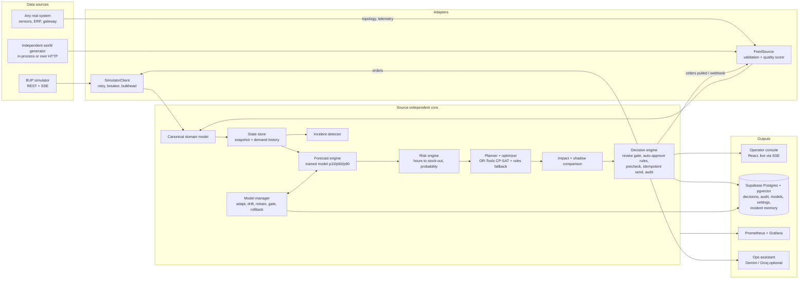

### One decision cycle

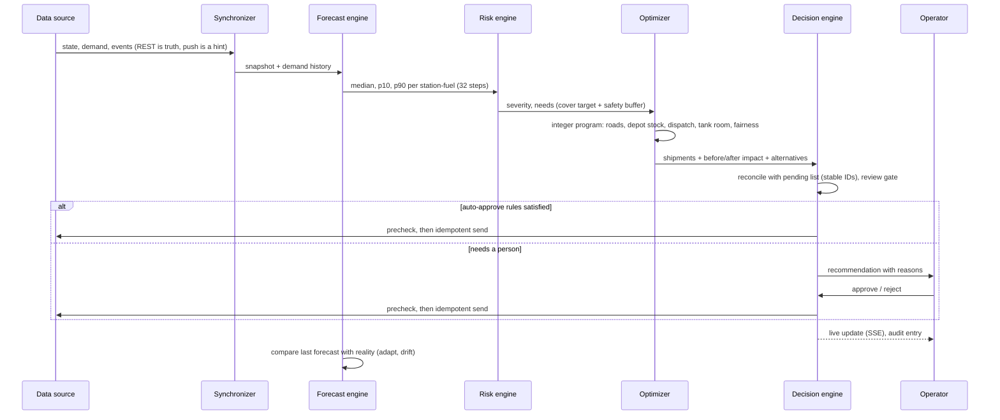

### How the model stays correct in a changing world

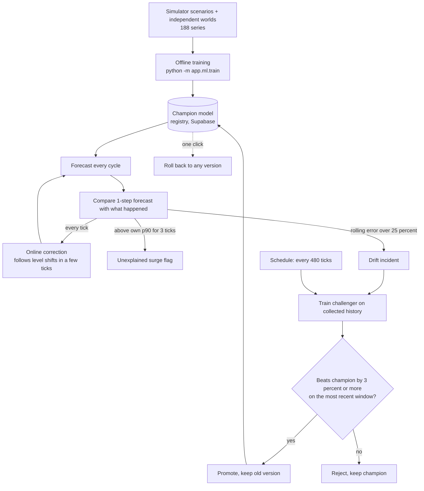

### Live-feed contract (how a real system connects)

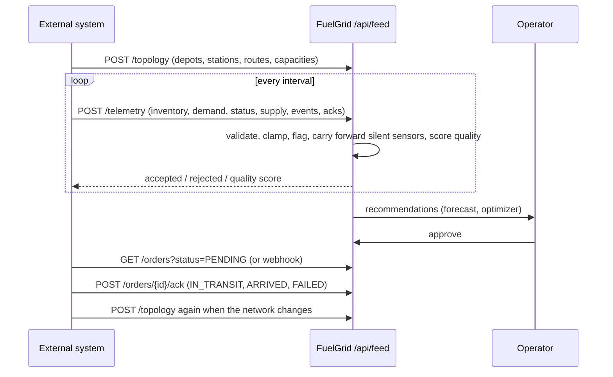

---

## 2. Results (all from this repository's own runs)

### Decision quality: identical crises replayed under three policies
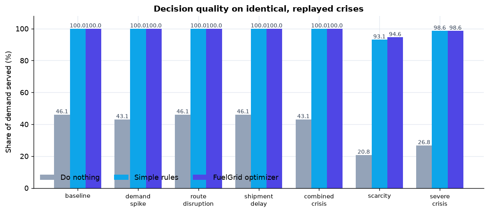

| Situation | Do nothing | Simple rules | FuelGrid optimizer |
|---|---:|---:|---:|
| Normal (2 days) | 46.1% | 100% | 100% |
| Demand jump in one city | 43.1% | 100% | 100% |
| Main road closed | 46.1% | 100% | 100% |
| Late deliveries | 46.1% | 100% | 100% |
| Combined crisis | 43.1% | 100% | 100% |
| Severe multi-failure (3 days) | 26.8% | 98.6% | 98.6% |
| **Fuel scarcity, supply cut to a quarter (3 days)** | 20.8% | 93.1% | **94.6%** |

Doing nothing fails. Both policies handle normal and medium crises; the optimizer's edge appears under real shortage (about a fifth less unmet demand than simple rules). Planner settings (32-tick cover target, 2.0 safety buffer) were chosen by sweep: [docs/TUNING_COMBOS.md](docs/TUNING_COMBOS.md).

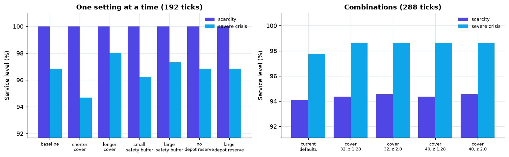

### The trained demand model
Pooled gradient-boosted quantile model (p10, p50, p90), 18 source-neutral features (time of day and week, latest value, 4/16/tick-day averages, same time yesterday / day before / last week, announced-event multiplier, volatility). No station, fuel or simulator-profile identity. Trained on **188 series / 226,560 observations / 250,000 rows** in ~22 s; model file 600 KB.

Data provenance: (a) the organizer's simulator driven through 5 scenarios by our collector (60 series), (b) four independent generated worlds with injected demand shifts, shifted daily peaks and surges (128 series). Everything is simulated; the collection and generation code is in the repo.

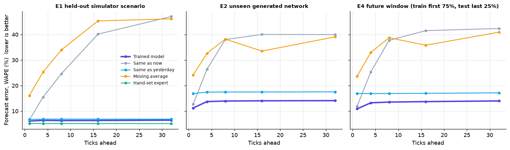

Walk-forward WAPE (total absolute error / total demand; lower is better), horizon = 8 ticks:

| Test | Trained model | Same as now | Same as yesterday | Moving average | Hand-set expert | 80% band holds |
|---|---:|---:|---:|---:|---:|---:|
| E1 held-out simulator scenario | **6.3%** | 24.6% | 6.9% | 34.0% | 5.1% | 78% |
| E2 unseen generated network | **13.9%** | 38.0% | 17.5% | 38.2% | - | 83% |
| E4 future window, all data | **13.5%** | 37.7% | 16.9% | 38.7% | - | 82% |
| E3a simulator-only model on a new world | 17.6% | 38.0% | 17.5% | 38.2% | - | **42%** |
| E3b worlds-only model on the simulator | 10.5% | 24.6% | 6.9% | 34.0% | 5.1% | 84% |

Honest reading: it beats simple baselines on unseen data with a calibrated band. On the simulator the hand-set expert is a little better because that formula *is* the simulator's generator (5% is the noise floor); the trained model gets within about a point without being told it. A model trained on the simulator alone is over-confident elsewhere (42% coverage), which is why the champion is trained on two worlds and retrains on each network's own data.

| Calibration | What it relies on |
|---|---|
| 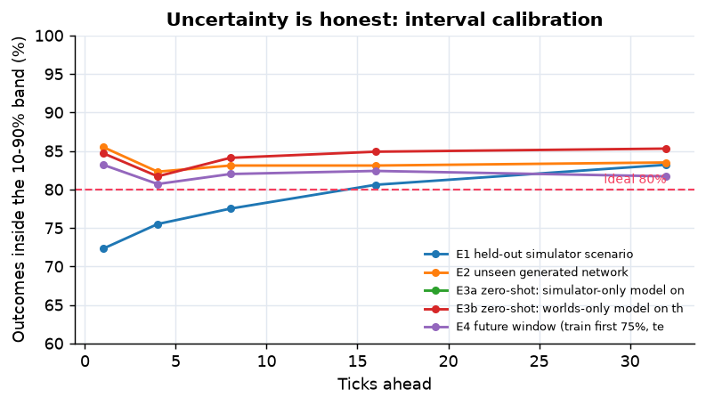 | 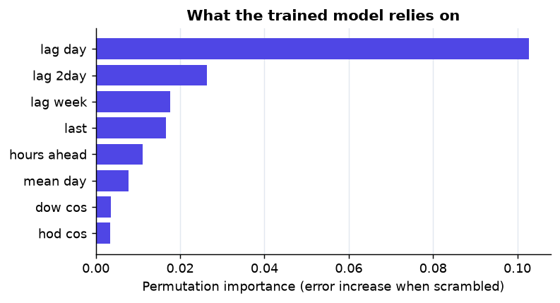 |

### Coping with a changing world
Same unseen network, same five surprises, five forecasting approaches, one optimizer, closed loop, hourly re-planning:

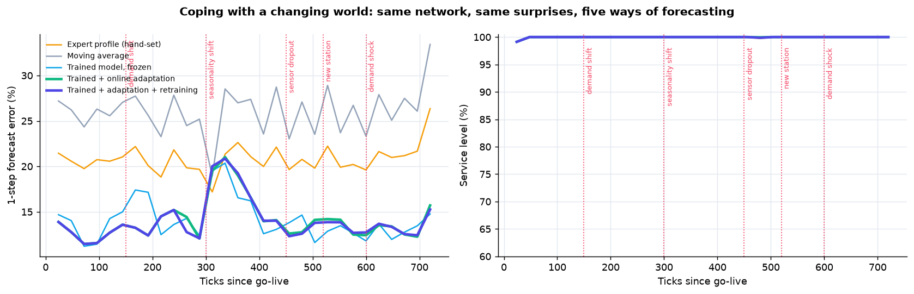

| Approach | Mean 1-step error | Service level |
|---|---:|---:|
| Hand-set expert profile | 20.7% | 99.97% |
| Moving average | 25.8% | 99.98% |
| **Trained model, frozen** | **14.1%** | 99.98% |
| Trained + online adaptation | 14.0% | 99.98% |
| Trained + adaptation + retraining | 14.0% (1 of 3 challengers promoted) | 99.97% |

The trained model forecasts ~32% better than the hand-set profile and ~45% better than a moving average, and stays at 12-17% around every surprise. Service is ~99.98% for all approaches because hourly re-planning from measured stock absorbs forecast error, which is the design answer to a dynamic world. Online correction adds little on top of the trained model (it already forecasts from recent history). A shifted daily pattern is the hardest surprise for everyone (error rises 13% to 20%); the retrain gate correctly rejected a challenger trained too soon after it. Details: [docs/ADAPTATION.md](docs/ADAPTATION.md).

### Performance under load
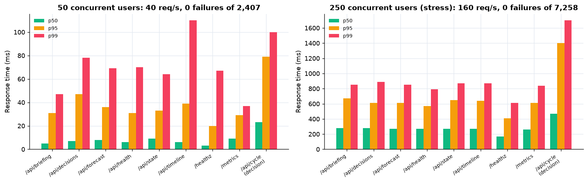

| Profile | Requests | Failures | p50 | p95 | p99 | Throughput |
|---|---:|---:|---:|---:|---:|---:|
| 50 users, 60 s | 2,407 | 0 | 8 ms | 37 ms | 68 ms | 40 req/s |
| 250 users, 45 s (stress) | 7,258 | 0 | 270 ms | 660 ms | 900 ms | 160 req/s (one core) |

The load test also found and we fixed a thread-safety error, repeated heavy work, and a way to overload the shared simulator. Full write-up: [docs/LOAD_TEST.md](docs/LOAD_TEST.md).

---

## 3. Controls (Controls page)

| Group | Controls |
|---|---|
| Engine | Start / pause, **emergency stop**, replan now, re-plan cadence, forecast horizon |
| Approvals | **Auto-approve on/off** (off by default), budget per cycle, largest single shipment, minimum confidence, minimum severity, approve all / reject all |
| Planning | Policy (optimizer / rules), cover target, safety buffer, depot reserve |
| Model | Model choice, online adaptation, auto-retrain, schedule, **retrain now**, activate / roll back any version |
| Resilience | Stale-data limit, optimizer rollback threshold |
| Data sources | Switch simulator / live feed, lock-step clock, demo world with live "change the world" buttons |

Every change is validated server-side, written to the audit log (old and new value) and saved in Supabase. After a restart auto-approve is deliberately left off. Set `API_KEY` to require a key for every write action.

**Pace matters.** The simulator's own Run mode ticks at a fixed 8 ticks/s whether or not anyone has planned; a platform that reads twice a second then falls behind. The **lock-step clock** (Data sources page) has FuelGrid advance the simulator itself (step, read, plan, repeat), so every tick is planned. A banner warns whenever the world outpaces planning.

---

## 4. Run it

```bash
# 1. organizer simulator (unmodified image)
docker compose -f simulator/docker-compose.yml up -d

# 2. settings: copy .env.example to .env (DATABASE_URL = Supabase session-pooler string; optional GEMINI_API_KEY, GROQ_API_KEY)

# 3. console (once)
cd frontend && npm ci && npm run build && cd ..

# 4. backend + console on http://127.0.0.1:8080
cd backend && uv sync --python 3.12 && uv run uvicorn app.main:app --host 127.0.0.1 --port 8080
```

Or everything in containers: `docker compose up --build` (add `--profile monitoring` for Prometheus + Grafana). On Windows use `127.0.0.1`, not `localhost`.

**See it run on a network the platform has never seen:** open *Data sources* → *Start demo world* → turn on auto-approve → click the "change the world" buttons. Or drive it from outside over HTTP:
`cd backend && uv run python -m app.worldgen.run --url http://127.0.0.1:8080 --ticks 600 --change 200:demand_shift --change 350:seasonality_shift`

### Reproduce every number
| What | Command |
|---|---|
| Tests (104) | `cd backend && uv run pytest -q` |
| Collect training data | `uv run python -m app.ml.collect --sim --worlds` |
| Train + evaluate the model | `uv run python -m app.ml.train` → `docs/MODEL.md` |
| Adaptation experiment | `uv run python -m app.ml.adapt` → `docs/ADAPTATION.md` |
| Decision benchmark | `uv run python -m app.scenarios.cli --scenarios all` |
| Tuning sweep | `uv run python -m app.scenarios.sweep` |
| Load test | `bash loadtest/run.sh` |
| Deploy a version (health-gated, auto-rollback) | `bash scripts/deploy.sh [tag]` |
| All graphs | `backend/.venv/Scripts/python scripts/make_figures.py` |

---

## 5. Project layout

| Path | Contents |
|---|---|
| `backend/app/domain` | Canonical models, errors, data-quality tracker |
| `backend/app/adapters` | Data-source contract, live-feed adapter |
| `backend/app/simulator` | Simulator adapter (retry, breaker, bulkhead) |
| `backend/app/state` | Store, synchronizer, lock-step clock |
| `backend/app/ml` | Features, model, backtests, manager (adapt / retrain / gate), datasets, training, adaptation experiment |
| `backend/app/intelligence` | Risk, optimizer + rules, planner, incident memory, assistant, LLM router, briefing |
| `backend/app/decision` | Decision engine |
| `backend/app/worldgen` | Independent world generator and drivers |
| `backend/app/api` | Routes, controls, feed, replay, models |
| `backend/ml_data`, `backend/ml_models` | Collected datasets, champion model |
| `frontend` | Operator console |
| `deploy`, `Dockerfile`, `docker-compose.yml`, `.github` | Deployment, monitoring, CI |
| `docs` | [Requirements coverage](docs/REQUIREMENTS_COVERAGE.md), [deliverables checklist](docs/DELIVERABLES.md), [finals demo runbook](docs/DEMO_RUNBOOK.md), architecture, benchmark, model, adaptation, tuning, load test, optional features |

## 6. Limitations (stated plainly)
Training data is simulated (no real network data was available). Planning only every several hours is throughput-limited by design (one shipment per road and fuel per plan). One process caps at about 160 requests/s. The model needs a little history per station (24 observations) before it takes over from a moving average. Reinforcement learning, multi-agent control and Kubernetes were deliberately not built; the reasons are in [docs/OPTIONAL_FEATURES.md](docs/OPTIONAL_FEATURES.md).

Everything is simulated. No real fuel infrastructure is touched; secrets live in the untracked `.env`.
