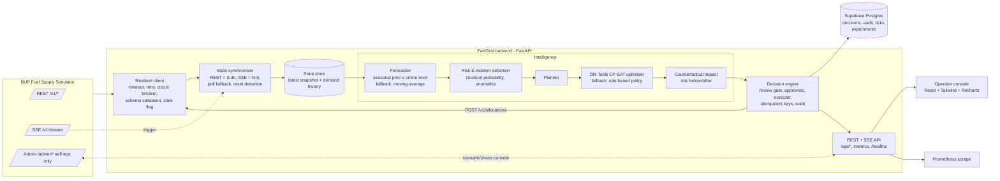

# FuelGrid — Architecture

FuelGrid is a fuel-supply decision-support platform built around the organizer's BUP Fuel Supply Simulator. It runs the
loop **Observe → Detect → Predict → Decide → Simulate → Act → Monitor → Recover** on every simulator tick.

## Modules (all replaceable)

| Package | Responsibility |
|---|---|
| `app/simulator` | Typed models, resilient HTTP client (retry/backoff via tenacity, circuit breaker, validation, stale detection) |
| `app/state` | Snapshot store, synchronizer (REST truth, SSE trigger, reconnect, reset detection) |
| `app/intelligence` | Forecasters, projection & risk, policies (`optimizer`, `rules`), planner with automatic fallbacks |
| `app/decision` | Decision engine: cycle, review gate, approval workflow, idempotent execution, incident detection, audit |
| `app/scenarios` | Scenario library, deterministic benchmark runner + CLI, experiment recording |
| `app/db` | Buffered, non-blocking Supabase persistence + SQL migrations |
| `app/api` | Read-models and HTTP routes (state, decisions, forecasts, benchmarks, chaos console) |
| `frontend` | Admin console (Overview, Network, Decisions, Forecast & Models, Scenarios, System, Audit) |

Policies and forecasters are registries (`POLICIES`, `FORECASTERS`): adding, versioning, rolling back or A/B-comparing
one is a one-line change plus a benchmark run.

## Intelligence

* **Forecast** — the simulator's documented hour-of-day demand profile is the *prior*; an EWMA of observed/prior demand
  calibrates level online (region factor, demand spikes, noise). Residual spread yields uncertainty (σ) and a confidence
  score. MAPE is tracked one step ahead and exported.
* **Risk** — deterministic roll-forward of inventory including in-flight shipments, plus a normal-error model for
  P(stockout) over an 8 h horizon; severity OK/WATCH/WARNING/CRITICAL; demand-anomaly detection (z-score).
* **Optimization** — CP-SAT integer program per decision cycle. Variables are shipment sizes per (route, fuel). Hard
  constraints mirror the simulator's validation order: route/station/depot status, route max shipment, depot stock
  (minus a reserve that is released when a station is critical), depot dispatch capacity per tick, station headroom.
  Objective: urgency-weighted shortfall with a convex fairness penalty, then transit cost. Deterministic (fixed seed,
  single worker).
* **Explainability** — each recommendation carries reasons, alternatives (with why-not), risk before/after, unmet
  demand avoided and confidence. Low confidence flags human review and blocks auto-execution.

## Resilience matrix

| Failure | Behaviour |
|---|---|
| Simulator slow / 5xx / unavailable | Timeout → retry with backoff+jitter → circuit breaker → cached-state degraded mode; recovery is logged |
| Invalid payload | Schema-rejected, alert raised, last good snapshot kept |
| `X-Simulator-Stale` | Flagged; auto-execution suspended |
| SSE dropped / `stream_disconnect` fault | Reconnect with exponential backoff; polling keeps state fresh; full REST re-sync after reconnect |
| Simulator reset | Detected from tick going backwards; caches and decisions cleared |
| Optimizer error/timeout/infeasible | Automatic rule-based fallback (counted in metrics + audit); after 3 failed cycles in a row the rule-based policy is made the active one (**automatic rollback**) until an operator restores the optimizer |
| Forecaster error | Automatic moving-average fallback |
| Allocation POST transient failure | Idempotent key → safe retry; gives up after 5 attempts |
| Forecast drift | Rolling forecast error above 25% raises a `model_drift` incident and a Prometheus alert |
| Too many concurrent callers | Simulator calls capped at 4 in flight; concurrent refreshes and concurrent decision requests each share one in-flight run, so a stampede costs one round of work |
| Database down | Writes buffered and retried; UI served from in-memory buffer; control loop unaffected |

## Observability

* `/metrics` (Prometheus): request rate/latency/errors (instrumentator), simulator call latency/outcomes, breaker state,
  SSE state, degraded flag, decision cycle latency, fallback activations, open alerts by severity, forecast confidence,
  forecast MAPE, allocation outcomes, service level, DB up.
* Structured JSON logs (structlog) for integration failures, decisions, fallbacks, recoveries.
* `/api/health`: component status (database, simulator, event stream, prediction, decision engine), API latency and
  error rate, process CPU/memory.
* Audit trail persisted in Supabase (`fg_audit`, `fg_decisions`, `fg_ticks`, `fg_experiments`).

## Assumptions & guardrails

* All results are simulated; no real infrastructure is touched. The only simulator write from `/v1/*` is
  `POST /v1/allocations`; `/admin/*` is used only by the scenario/chaos console and the benchmark runner.
* Human review is preserved: auto-execute is off by default, capped per cycle, and never applies to low-confidence
  recommendations or stale data. A kill-switch pauses planning and execution.
* Demand-profile priors come from the simulator guide (§8.5/8.6); no external datasets are used.

## Decision workflow (stable, live, reviewable)

* Pending recommendations are **reconciled, not regenerated**: the same (station, fuel, route) keeps the same decision id
  across cycles and only genuinely obsolete ones expire. The list never changes underneath the operator.
* Approve/Reject removes the card immediately (optimistic UI) and rolls back with a clear message if the server refuses.
* An accepted shipment is applied to the cached snapshot at once, so the next cycle never re-proposes it or spends the
  same depot stock twice.
* The UI is pushed on every data change or decision change (SSE hint, then REST re-read) with a 5 s polling safety net.

## Live plan comparison ("shadow evaluation")

Every cycle also evaluates, on the same state, what *doing nothing* and the *other* policy would have achieved
(expected unmet demand over the horizon). The Overview shows the three side by side, which is the "why should we trust
the optimizer" evidence, live.

## Protecting the shared simulator

The organizer's simulator has a very small database pool. FuelGrid therefore limits simultaneous simulator calls
(bulkhead), makes refreshes single-flight, and uses the circuit breaker so a struggling simulator is left alone to
recover. This was found (and fixed) through load testing; see `docs/LOAD_TEST.md`.

## Deployment

* `docker compose up --build` runs the simulator (organizer image, unmodified) and FuelGrid; the multi-stage
  `Dockerfile` builds the React console and the Python service into one image with a health check and a non-root user.
* `docker compose --profile monitoring up` adds Prometheus (with alert rules in `deploy/alerts.yml`) and Grafana with
  a pre-provisioned dashboard (`deploy/grafana/dashboards/fuelgrid.json`).
* `docker compose --profile localdb up` provides a local Postgres if Supabase is not available.
* CI (`.github/workflows/ci.yml`): lint, tests, type-check + frontend build, image build, container smoke test.
* Build version (git SHA) is baked into the image and shown by `/api/health`.
